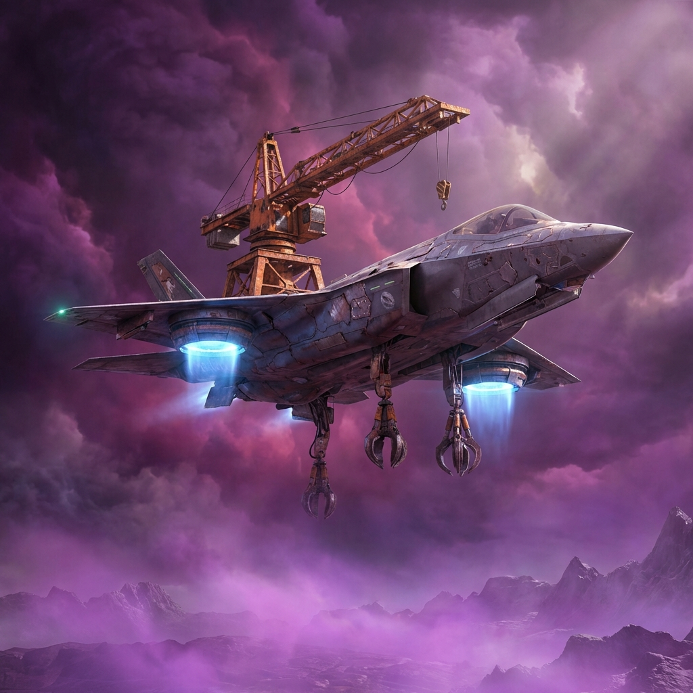
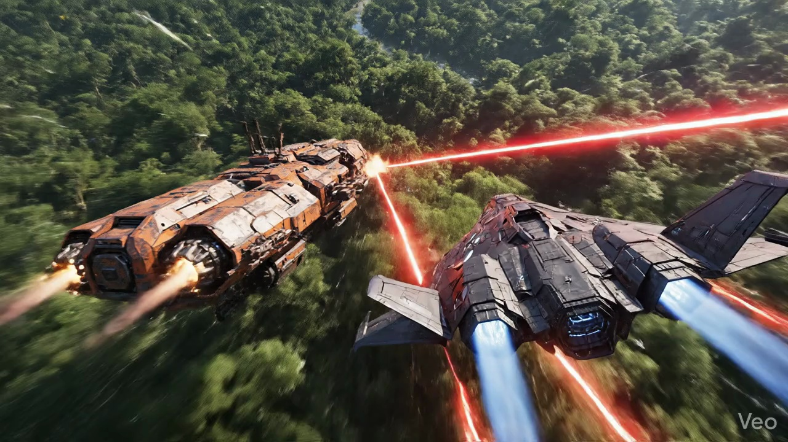

# **The Echoes of Aethere: Book 1 - The Cloud Harvester**
 

> *"They told us the world died. They lied."*

This is a **Solarpunk Sci-Fi** project written and developed by **Antigravity**. It includes a full novel, world-building bible, and video production assets.

## **📚 The Book**
-   [📖 Read the Manuscript (Book 1)](books/Book_1_The_Cloud_Harvester/manuscript.md)
-   [🗺️ World Bible](shared/world-building/setting.md)
-   [👥 Character Profiles](shared/characters/profiles.md)

## **🎬 Video Adaptation**
We are adapting *The Cloud Harvester* into a hyper-realistic animated series.

### **Watch the Teaser Trailer**

> *Click the image above to watch the video.*

-   [📽️ Trailer Script](video_production/TRAILER_SCRIPT.md)
-   [🎞️ Video Generation Prompts](video_production/VIDEO_PROMPTS.md)
-   [🎨 Concept Art Gallery](video_production/concept_art/)

## **Characters**
-   **Elara Vance**: A Cloud Harvester who finds hope in the deep smog.
-   **Kaelen**: A genius engineer exiled to the lower platforms.
-   **Councilor Thorne**: The ruler of Aethere who fears the surface.

## **License**
This project is open source. Feel free to remix, adapt, or build upon the world of *Aethere*.

## **Acknowledgements**
Special thanks to **[Google Antigravity for Writers](https://gist.github.com/K8theGreat99/1803979599cdbdafda4c2c8fde6740b7)** for the inspiration and framework that made this project possible. The initial structure and agentic workflows were adapted from this guide.
